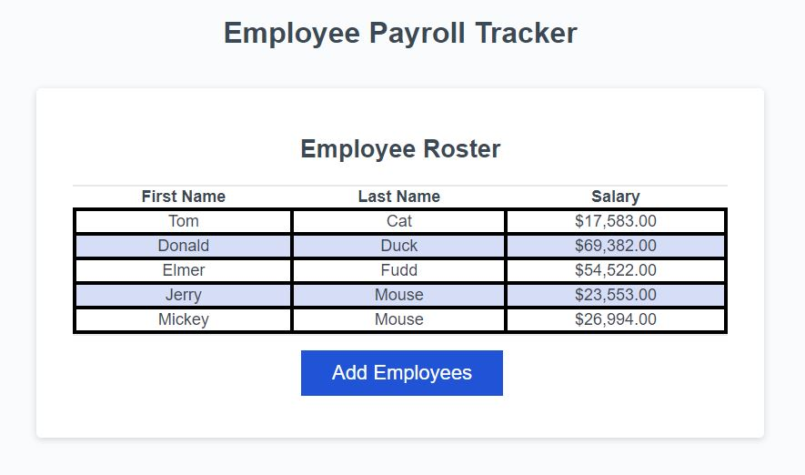

# Employee Payroll Bookkeeping

## Description
This project involved the creation of a program for a payroll manager to easily record and display the payroll information of a company's employees, as well as pick an employee from a random drawing and to log company-wide information like average salary.  The program already had working HTML and CSS code as well as the framework for some JavaScript functionality.  For this project, I added prompts for the "Add Employee" button that would request information from the user and return that information into an organized and sorted table on the webpage.  Additionally, I added the functionality for logging the average salary of the company's employees and picking a random employee as a drawing winner.

## Installation
N/A

## Usage
To use the webpage, follow [this link](https://njohnson2897.github.io/employee-payroll/)

The following screenshot demonstrates what the page should look like in a browser:

## Credits
I found information on indefinite while loops at: https://www.youtube.com/watch?v=BR9sBx3LBHU

I also found syntax on sum and filter methods at: https://stackoverflow.com/questions/53106132/find-average-of-an-array-of-objects

Information on isNaN function: https://developer.mozilla.org/en-US/docs/Web/JavaScript/Reference/Global_Objects/isNaN
